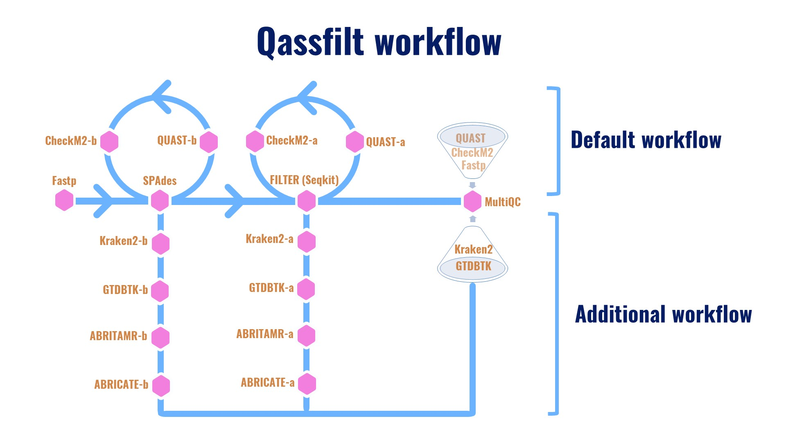

###### Color-based Pokémon ;-)
# QAssfilt
QAssfilt is a ready-to-use genome assembly filtering pipeline that provides high-quality contigs, ensuring confidence in your downstream analyses. Qassfilt is an independent, tool-based conda environment that is highly automated and flexible, allowing users to work independently with their preferred version of each dependency tool. The user could be employed with all kinds of Illumina paired-end reads. By default, the QAssfilt workflow includes [fastp](https://github.com/OpenGene/fastp) for trimming and assessing the quality of FASTQ files, [SPAdes](https://github.com/ablab/spades) as the assembler, [QUAST](https://github.com/ablab/quast) and [CheckM2](https://github.com/chklovski/CheckM2) for evaluating the quality of assembled and filtered genomes, [SeqKit](https://github.com/shenwei356/seqkit) for filtering contigs from assembled genomes, and finally [MultiQC](https://github.com/MultiQC/MultiQC) for aggregating and visualizing reports of raw data and genome assembly qualities. The complete pipeline workflow includes [Kraken2](https://github.com/DerrickWood/kraken2), [GTDB-Tk](https://github.com/Ecogenomics/GTDBTk), [ABRitAMR](https://github.com/MDU-PHL/abritamr), and [ABRicate](https://github.com/tseemann/abricate) for taxonomic classification and antimicrobial resistance gene detection. For those who worry a lot about the quality of the genome (contamination or misassemblies), running QAssfilt will help remove the unwanted contigs based on coverage and length (bp), and specific contig names if provided.
# Developer summary
QAssfilt works only via Conda and is designed specifically for Illumina paired-end reads. It was built without using containers, starting from the idea of creating the environment and tool independently to avoid conflicts between dependency tool versions that could interfere with the analysis. Moreover, it allows users to use their preferred version of the dependency tools without needing an upgrade from the developer.
# QAssfilt workflow

# Quick guide
Initialization is needed after installing QAssfilt. Please see [Initialization](https://github.com/hsamrach/QAssfilt#initialization) section.
```
# Basicer
qassfilt -i /path/input_dir -o /path/output_dir
or
qassfilt -i /path/input_dir -o /path/output_dir -d /path/database/CheckM2_database

# Advancer
qassfilt -i /path/input_dir -o /path/output_dir -d /path/database/CheckM2_database -id 2 --fastp "-q 30 -u 30" --spades "--isolate"

# Users unsatisfied with the default options
qassfilt -i /path/input_dir -o /path/output_dir -d /path/database/CheckM2_database -id 3 --fastp "-q 30 -u 30" --spades "--isolate" -kd /path/kraken2_database/ -gd /path/gtdbtk_database/ --abritamr "-j 16" --abricate "--minid 80 --mincov 80" -st 64 -ft 32 -ct 64 -qt 64 -mc 50 -ml 1000 --skip "FASTP"
```
# Installation
## Conda installation
Before installing QAssfilt, you have to have conda installed in your terminal. If you are new to conda, we suggest following the few steps below (credited to: [Koen-vdl](https://github.com/Koen-vdl/Conda-and-Bioconda-tutorial)) :
```
wget https://repo.anaconda.com/miniconda/Miniconda3-latest-Linux-x86_64.sh
```
Install it through this script:
```
sh Miniconda3-latest-Linux-x86_64.sh -b -s
rm Miniconda3-latest-Linux-x86_64.sh
```
Activate it to see (base) in your terminal before your path:
```
source ~/miniconda3/bin/activate
```
For permanent activation:
```
echo 'source ~/miniconda3/bin/activate' >> ~/.bash_profile   
```
Update to the latest version of conda:
```
conda update -n base -c defaults conda
```
Now you have your conda installed and activated via miniconda3.

The installation above is for Linux OS only. If you are using others, please find it via this link: https://repo.anaconda.com/miniconda and choose the one which suit with you.
## QAssfilt installation
Currently, QAssfilt isn't available on conda-forge, but you could install it via my channel:
```
conda create -n qassfilt_env -c samrachhan11 qassfilt -y
conda activate qassfilt_env
qassfilt -h # to show help
```
Otherwise, you could install QAssfilt through git clone also:
```
git clone https://github.com/hsamrach/QAssfilt.git
cd QAssfilt
chmod +x qassfilt.sh
qassfilt -h # to show help
```
# Usage
```
Usage: qassfilt -i ~/dir -o ~/dir [options]

  --INITIAL, -ini                       Initiallize QAssfilt, including checking and installing environments and tools (obligated for the first time)
  --INPUT_PATH, -i [DIR]                Path to directory containing fastq file (Apply for all Illumina paired end reads)
  --CONTIGS, -cg                        Enable contig mode (flag option)
                                        This will scan for fasta (.fa .fasta .fas .fna) in INPUT_PATH
  --OUTPUT_PATH, -o [DIR]               Path to output directory
  --INPUT_DIR_DEPTH, -id [INT]          Define directories to be scanned for fastq file (default: 1)
                                        e.g.: -id 1 will scan for only file in INPUT_PATH directory
                                        e.g.: -id 2 will scan all file in INPUT_PATH subdirectories
  --CHECKM2DB_PATH, -d [DIR]            Path to CheckM2 database directory (optional; if not given, pipeline will auto-manage)
  --KRAKEN2_DB_PATH, -kd [DIR]          Path to KRAKEN2 database directory (enables kraken2 step)
  --GTDBTK_DB_PATH, -gd [DIR]           Path to GTDBTK database directory (enables gtdbtk step)
  --SPADES_THREADS, -st [INT]           Threads for spades (default: 32)
  --FASTP_THREADS, -ft [INT]            Threads for fastp (default: 16)
  --CHECKM2_THREADS, -ct [INT]          Threads for CheckM2 (default: 16)
  --QUAST_THREADS, -qt [INT]            Threads for QUAST (default: 16)
  --KRAKEN2_THREADS, -kt [INT]          Threads for KRAKEN2 (default: 16)
  --GTDBTK_THREADS, -gt [INT]           Threads for GTDBTK (default: 16)
  --QUAST_REFERENCE, -qr [FILE]         Path to reference sequence for QUAST (optional)
  --SEQKIT_MIN_COV, -mc [INT]           Minimum (≤) contig coverage to be filtered (default: 10)
  --SEQKIT_MIN_LENGTH, -ml [INT]        Minimum (≤) contig length to be filtered (default: 500)
  --skip [LIST]                         Skip tool(s) you don't want to use in the pipeline (space-separated)
                                        e.g.: --skip "FASTP SPADES QUAST-b CHECKM2-b FILTER QUAST-a CHECKM2-a KRAKEN2-b KRAKEN2-a GTDBTK-b GTDBTK-a
                                        "ABRITAMR-b ABRITAMR-a ABRICATE-b ABRICATE-a MULTIQC"
  --contigs_remove, -cr [FILE]          Path to file containing contigs to remove.
                                        Create a tab file with the path to the fasta file at column 1 and the contig name at column 2(separated by a comma for multiple names).
  --fastp [STRING]                      Options/parameters to pass directly to fastp
                                        e.g.: "-q 30 -u 30 -e 15 -l 50 -5 -3, ..."
  --spades [STRING]                     Options/parameters to pass directly to SPAdes
                                        e.g.: "--isolate --careful --cov-cutoff auto, ..."
  --abricate [STRING]                   Options/parameters to pass directly to abricate except --db (enables abricate step)
                                        e.g.: Use at least an option to enable abricate "--minid 80, --mincov 80,..."
  --abritamr [STRING]                   Options/parameters to pass directly to abritamr (enables abritamr step)
                                        e.g.: Use at least an option to enable abritamr "--species Escherichia, -j 16 ..."
  --version, -v                         Check QAssfilt version
  --help, -h                            Show this help message and exit
```
## Initialization
After successfully installing QAssfilt, you will have two choices for initialization:
### 1. Automatically initialized
You can use --INITIAL, -ini for automatic initialization by checking and installing tools and environments, and also download checkm2 database if the option --CHECKM2DB_PATH, -d is not use.
```
qassfilt -ini
```
In case you already have Checkm2 database. It will export your database for Checkm2 by using --CHECKM2DB_PATH, -d. (No Checkm2 database will be downloaded)
```
qassfilt -ini -d /PATH/databases/CheckM2_database
```
Ten environments will be produced, and each tool will be installed in each of its environments.
```
qassfilt_checkm2
qassfilt_fastp
qassfilt_spades
qassfilt_quast
qassfilt_seqkit
qassfilt_kraken2
qassfilt_gtdbtk
qassfilt_abritamr
qassfilt_abricate
qassfilt_multiqc
```
### 2. Manually created environments and tools (Highly recommended for user who have their preferred tool version)
You can create 6 environments above (same environment name) and install the tool in each environment so that QAassfilt will scan for the environments and tools.
To verify whether the manually created works well or not, please run :
```
qassfilt -ini
```
or
```
qassfilt -ini -d /PATH/databases/CheckM2_database
```
QAssfilt will check the environment and calling version of each tool. If it is working okay, initialization is completed without installing any tool.
## Input file format (--INPUT_PATH, -i [DIR])
QAssfilt works only on Illumina paired-end reads, but all fastq file extensions, including gz format.
The very nice thing from QAssfilt is that you need to give only the input directory, and then it will scan for each pair of fastq files. Suppose you have files in different subdirectories of the input directory. In that case, you can also use the option --INPUT_DIR_DEPTH, -id, so that it will scan each subdirectory based on the number of DEPTH you provided.
For example:
```
qassfilt -i /path/input_dir -id 2 -o /path/output-dir

input_dir/
├── file1_R1.fastq.gz
├── file1_R2.fastq.gz
└── subdirectory1/
│   ├── file2_1.fastq
│   └── file2_2.fastq
└── subdirectory2/
    ├── file3_1.fq.gz
    └── file3_2.fq.gz
```
So it will pick up only the fastq files in input_dir and subdirectory1. To make it also pick up subdirectory2, you can use -id 3.
## Output file and directory (--OUTPUT_PATH, -o [DIR])
During and after running, QAssfilt will produce:
```
output_dir/
|
├── logs: Log file of each step run, including errors and information in detail.
|
├── spades_file: Raw output directory of each sample of the spades step.
|
├── contigs_before: Original contig files from SPAdes, renamed based on sample ID (before filtering).
|
├── contigs_filtered: filtered contig files of each sample ID.
|
├── quast_before: Quast output from unfiltered contig files.
|
├── quast_after: Quast output from filtered contig files.
|
├── checkm2_before: CheckM2 output from unfiltered contig files.
|
├── checkm2_after: CheckM2 output from filtered contig files.
|
├── kraken2: kraken2 output from filtered contig files. (before and after)
|
├── gtdbtk:
│   ├── before: GTDB-TK output before filtering.
|   |
│   └── after: GTDB-TK output after filtering.
|
├── abricate: the output of the abricate run in all available databases. (before and after)
|
├── abritamr:
│   ├── before: abritamr output before filtering.
|   |
│   └── after: abritamr output after filtering.
|
├── multiqc_reports/
|   |
│   ├── fastp: An HTML file for viewing the report from fastp.
|   |
│   └── Assembly_qc: An HTML file for viewing the report from Quast and CheckM2, including before and after filtering.
|   |
│   ├── kraken2: An HTML file for viewing the report from kraken2.
|   |
│   └── gtdbtk: An HTML file for viewing the report from gtdbtk.
│
├── pipeline_status.tsv: Status of each step/tool during and after pipeline execution.
|
└── pipeline_parameters.txt: Options and parameters used in pipeline.
```
## Options and Parameters
##### --CONTIGS, -cg
Suppose you already have your assembled genome as contig files, but you would like to use our service to assess quality and filter the contig files. In this case, you can use this option, and fastp and SPAdes will be automatically skipped. The pipeline will start from quast-b, checkm2-b, filter, quast-a, checkm2-a, and finally multiqc. (default: disable)
##### --CHECKM2DB_PATH, -d
Use this option if you already have the CheckM2 database, so it won’t download a new one. Otherwise, if you don’t specify it, QAssfilt will check in the default path ($HOME/databases/CheckM2_database). If the CheckM2 database already exists in this default path, it won’t be downloaded, but if it does not exist, it will be downloaded into the default path.
##### --KRAKEN2_DB_PATH, -kd | --GTDBTK_DB_PATH, -gd | --abricate | --abritamr
By default, these tools were skipped. Once they are triggered, the workflow will include them.
##### --SEQKIT_MIN_COV, -mc
This will only pick up the contigs that have coverage greater than the number you specify to generate filtered contig files. Its mechanism is to extract contig headers and check the coverage number. So, if you use --CONTIGS, -cg, make sure your contig headers contain coverage information.
For example:
```
NODE_1_length_12345_cov_37.8
contig0001_cov_50
scaffold_12_cov_100.0
contig001_depth_42.7
NODE_2_length_23456_depth_88
```
All headers contain 'cov' and 'depth', which can be used by this mechanism.
##### --SEQKIT_MIN_LENGTH, -ml
This will only pick up the contigs that have length (bp) greater than the number you specify to generate filtered contig files. This mechanism can be applied to all types of contig files since it counts the length (bp) of each contig directly.
##### --skip
This allows users to skip any step they want if they only need a specific step.
For example:
```
qassfilt -i /path/input_dir -o /path/output_dir --skip "FASTP"
```
This will skip the FASTP step and run SPAdes automatically by finding paired-end FASTQ files in the input directories.
##### --fastp
This option provides free access to the options and parameters of fastp (please see the fastp instructions: https://github.com/OpenGene/fastp).
For example:
```
qassfilt -i /path/input_dir -o /path/output_dir --fastp "-q 30 -u 30"
```
##### --spades
This option provides free access to the options and parameters of SPAdes (please see the SPAdes instructions: https://github.com/ablab/spades). For example:
```
qassfilt -i /path/input_dir -o /path/output_dir --spades "--isolate --cov-cutoff auto"
```
##### --contigs_remove, -cr
This option is specifically used when you know which contig names are contaminated or belong to unwanted pathogens. To use it, you need to provide a tab-delimited file following the template below:
```
#column1<TAB>#column2
/path/sample001.fasta<TAB>NODE_83_length_3835_cov_218.746408,NODE_76_length_8849_cov_249.766302,NODE_72_length_10578_cov_311.188649
/path/sample002.fasta<TAB>NODE_81_length_3835_cov_218.746408
/path/sample003.fasta<TAB>NODE_80_length_3835_cov_218.746408,NODE_79_length_8849_cov_249.766302
```
For example:
```
qassfilt -cr contigs_to_be_removed.tab
```
This will remove the unwanted contigs and generate a new fasta file as sample001_removed.fasta, sample002_removed.fasta, sample003_removed.fasta at the same path provided in column 1.
## Resume function
QAssfilt is resumable by simply retyping the previous command that was interrupted. The resume mechanism works by scanning the last incomplete step and sample to determine where to restart. It then checks whether the final output file exists. If it does, Qassfilt proceeds to the next step; if not, it reruns the current step recorded in the log file.
# Dependencies
QAssfilt uses the following dependency tools:
- [fastp](https://github.com/OpenGene/fastp)
- [SPAdes](https://github.com/ablab/spades)
- [QUAST](https://github.com/ablab/quast)
- [CheckM2](https://github.com/chklovski/CheckM2)
- [SeqKit](https://github.com/shenwei356/seqkit)
- [MultiQC](https://github.com/MultiQC/MultiQC)
# Information
## License
QAssfilt is free for everyone, and released under [GPL (version 3)](https://github.com/hsamrach/QAssfilt/blob/main/LICENSE).
## Issues
Any comments and suggestions, please submit to the [Issues](https://github.com/hsamrach/QAssfilt/issues).
## Acknowledgement
QAssfilt is built on the proposal and suggestion of [Praveen Rahi](https://github.com/RahiPraveen), initially built by [Furqan Khan](https://github.com/furqan8192902), and fully re-built in advance using shell scripts by [Samrach Han](https://github.com/hsamrach) with assistance from [ChatGPT](https://chatgpt.com/?model=auto).
