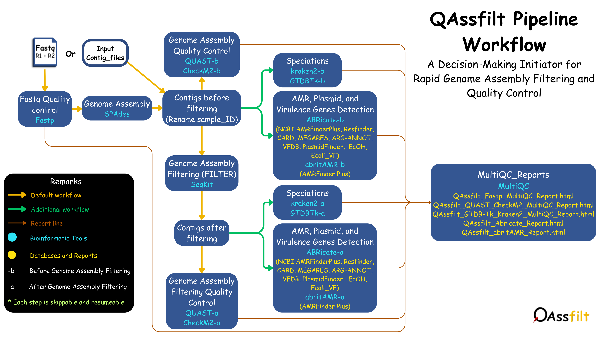
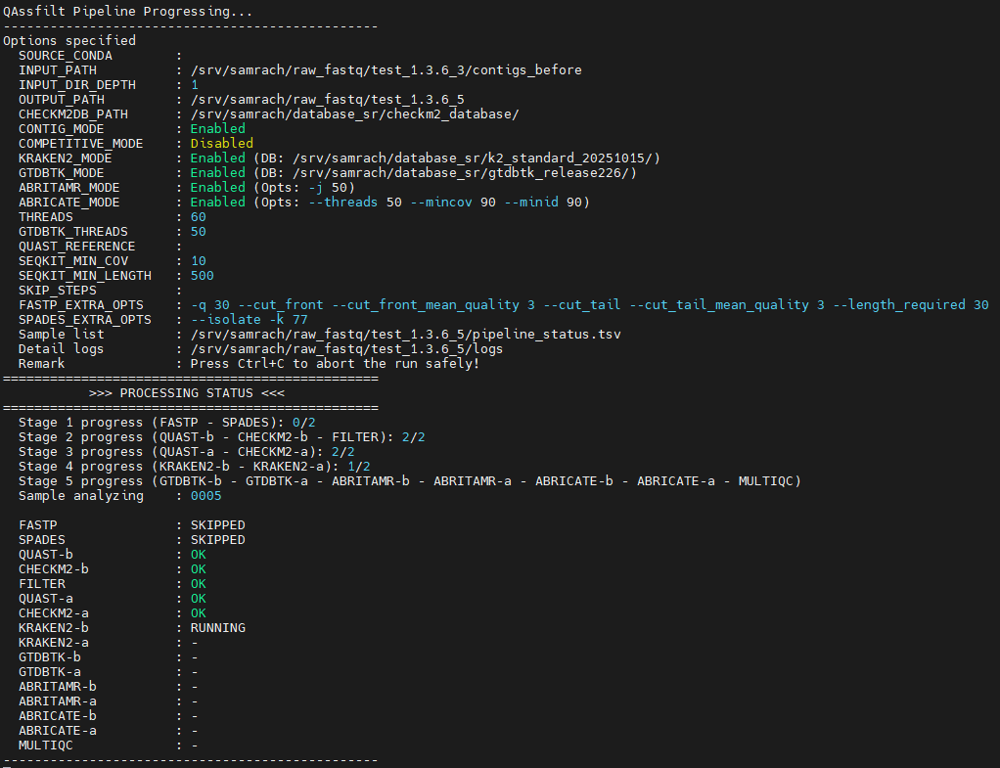

[](https://anaconda.org/samrachhan11/qassfilt) [](https://anaconda.org/samrachhan11/qassfilt) [](https://anaconda.org/samrachhan11/qassfilt) [](https://anaconda.org/samrachhan11/qassfilt)
 
###### Color-based Pokémon
# QAssfilt
QAssfilt is a ready-to-use genome assembly filtering pipeline that provides high-quality contigs, ensuring confidence in your downstream analyses. Qassfilt is an independent, tool-based conda environment that is rapidly analyzed, highly automated, and flexible, allowing users to work independently with their preferred version of each dependency tool. The user could be employed with all kinds of Illumina paired-end reads. The complete QAssfilt workflow includes [fastp](https://github.com/OpenGene/fastp) for trimming and assessing the quality of FASTQ files, [SPAdes](https://github.com/ablab/spades) as the assembler, [QUAST](https://github.com/ablab/quast) and [CheckM2](https://github.com/chklovski/CheckM2) for evaluating the quality of assembled and filtered genomes, [SeqKit](https://github.com/shenwei356/seqkit) for filtering contigs from assembled genomes based on contig coverage and length (bp), [Kraken2](https://github.com/DerrickWood/kraken2) and [GTDB-Tk](https://github.com/Ecogenomics/GTDBTk) for speciations, [ABRitAMR](https://github.com/MDU-PHL/abritamr) and [ABRicate](https://github.com/tseemann/abricate) for antimicrobial resistance genes, plasmid genes, and virulence factor detection, and finally [MultiQC](https://github.com/MultiQC/MultiQC) for aggregating and visualizing reports. For those who worry a lot about the quality of the genome (contamination or misassemblies), running QAssfilt will help remove these issues.
# Developer summary
QAssfilt works only via Conda and is designed specifically for Illumina paired-end reads. It was built from the idea of creating the environment and tool independently to avoid conflicts between dependency tool versions that could interfere with the analysis (credited to [bohra](https://github.com/MDU-PHL/bohra)). Moreover, it allows users to use their preferred version of the dependency tools without needing an upgrade from the developer, and also build their own container, if highly reproducible is preferred.
# Outlines
  - [QAssfilt workflow](#qassfilt-workflow)
  - [Quick guide](#quick-guide)
  - [Progressing status](#progressing-status)
  - [Installation](#installation)
  - [Usage](#usage)
  - [Initialization](#initialization)
  - [Input file format](#input-file-format---input_path--i)
  - [Output file and directory](#output-file-and-directory---output_path--o)
  - [Options and Parameters](#options-and-parameters)
  - [Resume function](#resume-function)
  - [Dependencies](#dependencies)
  - [Container](#container)
  - [Information](#information)
# QAssfilt workflow

# Quick guide
Initialization is needed after installing QAssfilt. Please see [Initialization](#initialization) section.
```
# Basicer
qassfilt -i /path/input_dir -o /path/output_dir -t 16
or
qassfilt -i /path/input_dir -o /path/output_dir -cd /path/database/CheckM2_database -t 16

# Advancer
qassfilt -i /path/input_dir -o /path/output_dir -cd /path/database/CheckM2_database -id 2 --fastp "-q 30 -u 30" --spades "--isolate" -t 16

# Users unsatisfied with the default options
qassfilt -i /path/input_dir -o /path/output_dir -cd /path/database/CheckM2_database -cp -id 3 --fastp "-q 30 -u 30" --spades "--isolate" -kd /path/kraken2_database/ -gd /path/gtdbtk_database/ --abritamr "-j 16" --abricate "--minid 80 --mincov 80" -t 32 -mc 50 -ml 1000 --skip "FASTP"
```
# Progressing status


While running, QAssfilt will update the progression for the user to be trackable.
# Installation
## Conda installation
Before installing QAssfilt, you have to had conda and mamba installed in your terminal. If you are new to conda and mamba, we suggest following the few steps below (credited to: [Koen-vdl](https://github.com/Koen-vdl/Conda-and-Bioconda-tutorial)) :
```
wget https://repo.anaconda.com/miniconda/Miniconda3-latest-Linux-x86_64.sh
```
Install it through this script:
```
sh Miniconda3-latest-Linux-x86_64.sh -b -s
rm Miniconda3-latest-Linux-x86_64.sh
```
Activate it to see (base) in your terminal before your path:
```
source ~/miniconda3/bin/activate
```
For permanent activation:
```
echo 'source ~/miniconda3/bin/activate' >> ~/.bash_profile   
```
Update to the latest version of conda:
```
conda update -n base -c defaults conda
```
Now you can install mamba:
```
conda install -n base -c conda-forge mamba -y
```
Now you have your conda and mamba installed and activated via miniconda3. (You can also install [Miniforge3](https://github.com/conda-forge/miniforge/releases) so that you can have both conda and mamba installed directly)

Note: You can also run the QAssfilt pipeline without activating Conda.

The installation above is for Linux OS only. If you are using others, please find it via this link: https://repo.anaconda.com/miniconda and choose the one that suits you.
## QAssfilt installation
Currently, QAssfilt can be installed through conda (only one script will be installed, it won't conflict with the other tool):
```
conda install -n base -c samrachhan11 qassfilt=1.3.7 -y #latest version
```
Or
```
mamba install -n base -c samrachhan11 qassfilt=1.3.7 -y #latest version
```
Test it with help option
```
qassfilt -h # to show help
```
Otherwise, you could install QAssfilt through git clone also:
```
git clone https://github.com/hsamrach/QAssfilt.git
cd QAssfilt
chmod +x qassfilt.sh
./qassfilt -h # to show help
```
# Usage
```
Usage: qassfilt -i ~/dir -o ~/dir [options]

  --initial, -ini                       Initialize QAssfilt, including checking and installing environments and tools (obligated for the first time)
  --source_conda, -sc [dir]             Path to source conda environment (optional; if not given, pipeline will use default)
                                        e.g.: --source_conda, -sc /home/user/miniconda3/
  --input_path, -i [dir]                Path to directory containing fastq file (Apply for all Illumina paired end reads)
  --contigs, -cg                        Enable contig mode (flag option)
                                        This will scan for fasta (.fa .fasta .fas .fna .ffn) in input_path
  --competitive, -cp                    Enable competitive mode (flag option)
  --output_path, -o [dir]               Path to output directory
  --input_dir_depth, -id [N]            Define directories to be scanned for fastq file (default: 1)
                                        e.g.: -id 1 will scan for only files in input_path directory
                                        e.g.: -id 2 will scan all files in input_path subdirectories
  --checkm2_db_path, -cd [dir]          Path to CheckM2 database directory (optional; if not given, pipeline will auto-manage)
  --kraken2_db_path, -kd [dir]          Providing path to KRAKEN2 database directory to enable kraken2 step (default: disable)
  --gtdbtk_db_path, -gd [dir]           Providing path to GTDBTK database directory to enable gtdbtk step (default: disable)
  --threads, -t [N]                     Number of threads for fastp, spades, quast, checkm2, and kraken2 (default: 8)
  --gtdbtk_threads, -gt [N]             Threads for GTDBTK (default: 8)
  --quast_reference, -qr [file]         Path to reference sequence for QUAST (optional)
  --filter_min_cov, -mc [N]             Minimum (≤) contig coverage to be filtered (default: 10)
  --filter_min_length, -ml [N]          Minimum (≤) contig length to be filtered (default: 500)
  --skip [list]                         Skip tool(s) you don't want to use in the pipeline (space-separated)
                                        e.g.: --skip "FASTP SPADES QUAST-b CHECKM2-b FILTER QUAST-a CHECKM2-a KRAKEN2-b KRAKEN2-a GTDBTK-b GTDBTK-a
                                        ABRITAMR-b ABRITAMR-a ABRICATE-b ABRICATE-a MULTIQC"
  --contigs_remove, -cr [file]          A tab-delimited file with path to fasta file (column1) and contig NODE (column2, separated by comma if multiple).
  --fastp [string]                      Options/parameters to pass directly to fastp
                                        e.g.: "-q 30 -u 30 -e 15 -l 50 -5 -3, ..."
  --spades [string]                     Options/parameters to pass directly to SPAdes
                                        e.g.: "-k 77 --isolate --careful --cov-cutoff auto, ..."
  --abricate [string]                   Options/parameters to pass directly to abricate, except "--db" to enable abricate step (default: disable)
                                        e.g.: Use at least an option to enable abricate "--minid 80, --mincov 80, --threads 8,..."
  --abritamr [string]                   Options/parameters to pass directly to abritamr to enable abritamr step (default: disable)
                                        e.g.: Use at least an option to enable abritamr "--species Escherichia, -j 8,..."
  --version, -v                         Show QAssfilt version and exit
  --help, -h                            Show this help message and exit
```
## Initialization
After successfully installing QAssfilt, you will have two choices for initialization:
### 1. Automatically initialized
You can use --initial, -ini for automatic initialization by checking and installing tools and environments, and also download checkm2 database if the option --checkm2_db_path, -cd is not use.
```
qassfilt -ini
```
In case you already have CheckM2 database. It will export your database for Checkm2 by using --checkm2_db_path, -cd. (No Checkm2 database will be downloaded)
```
qassfilt -ini -cd /PATH/databases/CheckM2_database
```
Ten environments will be produced, and each tool will be installed in each of its environments.
```
qassfilt_checkm2
qassfilt_fastp
qassfilt_spades
qassfilt_quast
qassfilt_seqkit
qassfilt_kraken2
qassfilt_gtdbtk
qassfilt_abritamr
qassfilt_abricate
qassfilt_multiqc
```
### 2. Manually created environments and tools (Highly recommended for user who have their preferred tool version)
You can create 10 environments above (same environment name) and install the tool in each environment so that QAassfilt will scan for the environments and tools.
To verify whether the manually created works well or not, please run :
```
qassfilt -ini
```
or
```
qassfilt -ini -cd /PATH/databases/CheckM2_database
```
QAssfilt will check the environment and calling version of each tool. If it is working okay, initialization is completed without installing any tool.
## Input file format (--input_path, -i)
QAssfilt works only on Illumina paired-end reads, but all fastq file extensions, including gz format.
The very nice thing from QAssfilt is that you need to give only the input directory, and then it will scan for each pair of fastq files. Suppose you have files in different subdirectories of the input directory. In that case, you can also use the option --input_dir_depth, -id, so that it will scan each subdirectory based on the number of depth you provided.
For example:
```
qassfilt -i /path/input_dir -id 2 -o /path/output-dir

input_dir/
├── file1_R1.fastq.gz
├── file1_R2.fastq.gz
└── subdirectory1/
    ├── file2_1.fastq
    └── file2_2.fastq
    └──subdirectory2/
       ├── file3_1.fq.gz
       └── file3_2.fq.gz
```
So it will pick up only the fastq files in input_dir and subdirectory1. To make it also pick up subdirectory2, you can use -id 3.
## Output file and directory (--output_path, -o)
During and after running, QAssfilt will produce:
```
output_dir/
|
├── fastp_file: Trimmed fastq files of each sample.
├── contigs_before: Original contig files from SPAdes, renamed based on sample ID (before filtering).
├── contigs_filtered: Filtered contig files of each sample.
├── multiqc_reports: HTML reports of each tool.
│   ├── QAssfilt_Fastp_MultiQC_Report.html
│   └── QAssfilt_QUAST_CheckM2_MultiQC_Report.html
│   └── QAssfilt_GTDB-Tk_Kraken2_MultiQC_Report.html
│   └── QAssfilt_Abricate_Report.html
│   └── QAssfilt_abritAMR_Report.html
│
└── raw/
│   ├── spades_file: Raw output directory of each sample of the spades step.
│   ├── quast_before: Quast output before filtering.
│   ├── quast_after: Quast output after filtering.
│   ├── checkm2_before: CheckM2 output before filtering.
│   ├── checkm2_after: CheckM2 output after filtering.
│   ├── kraken2: kraken2 output of each sample. (before and after)
│   ├── gtdbtk:
│   │   ├── before: GTDB-TK output before filtering.
│   │   └── after: GTDB-TK output after filtering.
│   ├── abricate: the output of the abricate run in all available databases. (before and after)
│   └── abritamr:
│       ├── before: abritamr output before filtering.
│       └── after: abritamr output after filtering.
│
├── logs: Log file of each step run, including errors and information in detail.
├── pipeline_status.tsv: Status of each step/tool during and after pipeline execution.
└── pipeline_parameters.txt: Options, parameters, time consumed, and version used in pipeline.
```
## Options and Parameters
##### --source_conda, -sc
Somehow, the user might have various conda installations on their server (e.g, anaconda, miniconda3, etc.). Therefore, we provided this option to particular use one of their conda as they wished. No need to specify if you have only one conda on your server. (QAssfilt will automatically used it)

By default, it will scan for conda.sh automatically via the paths below:
```
    /opt/miniconda* \
    /opt/anaconda* \
    /opt/miniforge* \
    /opt/mambaforge \
    /opt/conda \
    $HOME/miniconda* \
    $HOME/anaconda* \
    $HOME/conda \
    $HOME/miniforge* \
    $HOME/mambaforge \
    /usr/local/miniconda* \
    /usr/local/anaconda* \
    /usr/local/miniforge* \
    /usr/local/mambaforge \
    /usr/local/conda
```
##### --contigs, -cg (Contigs_Mode) (default: disable)
Suppose you already have your assembled genome as contig files, but you would like to use our service to assess quality and the filtering system. In this case, you can use this option, and fastp and SPAdes will be automatically skipped. 
##### --competitive, -cp (Competitive_Mode) (default: disable)
Competitive Mode is designed for emergency analyses, maximizing parallel sample processing while safeguarding system resources from overload.

This mode works by automatically detecting available CPUs and calculating the optimal number of parallel sample runs—using up to 90% of total CPUs divided by the specified --threads, -t (default: 8) to prevent overload and ensure system stability.

For example: 
```
- Calculate 90% of total CPUs (e.g, 64 CPUs)
64×0.9 = 57.6 ≈ 57 CPUs available for pipeline
- Divided by threads (e.g, 8 CPUs)
Number of samples that can run in parallel = 57​/8 ≈ 7 samples
- Thus, 7 samples will run in parallel. As soon as one of these samples completes the last step (default: kraken2-a), the next sample in the queue will begin, ensuring efficient use of system resources.
```
**Note:** once competitive mode is enabled, the workflow of GTDBTk, Abritamr, and Abricate will be changed to run GTDBTk-b/-a, abritamr-b, and abricate-b in parallel.
##### --checkm2_db_path, -cd 
Use this option if you already have the CheckM2 database, so it won’t download a new one. Otherwise, if you don’t specify it, QAssfilt will check in the default path ($HOME/databases/CheckM2_database). If the CheckM2 database already exists in this default path, it won’t be downloaded, but if it does not exist, it will be downloaded into the default path.

Note: please store only one (.dmnd) file in the database directory.
##### --kraken2_db_path, -kd | --gtdbtk_db_path, -gd | --abricate | --abritamr (default: disable)
By default, these tools were skipped. Once they are triggered by providing an option or databases (see help information), the workflow will include them.

Users have to had Kraken2 and GTDB-TK database downloaded. Otherwise, you can download through the link below:
```
For [GTDB-Tk](https://github.com/Ecogenomics/GTDBTk): Credit to GTDB-Tk
wget https://data.ace.uq.edu.au/public/gtdb/data/releases/latest/auxillary_files/gtdbtk_package/full_package/gtdbtk_data.tar.gz

For [Kraken2](https://github.com/DerrickWood/kraken2): Credit to Kraken2
Click this link and download your preferred pre-built kraken2 database: https://benlangmead.github.io/aws-indexes/k2
Otherwise, you can build it yourself through the Kraken2 instruction.
```
##### --filter_min_cov, -mc
This will only pick up the contigs that have coverage greater than the number you specify to generate filtered contig files. Its mechanism is to extract contig headers and check the coverage number. So, if you use --contig, -cg, make sure your contig headers contain coverage information.
For example:
```
NODE_1_length_12345_cov_37.8
contig0001_cov_50
scaffold_12_cov_100.0
contig001_depth_42.7
NODE_2_length_23456_depth_88
```
Note: Each headers must be none spaces. Only headers contain 'cov' and 'depth' are able to use this mechanism.

##### --filter_min_length, -ml
This will only pick up the contigs that have length (bp) greater than the number you specify to generate filtered contig files. This mechanism can be applied to all types of contig files since it counts the length (bp) of each contig directly.
##### --skip
This allows users to skip any step they want if they only need a specific step.
For example:
```
qassfilt -i /path/input_dir -o /path/output_dir --skip "FASTP"
```
This will skip the FASTP step and run SPAdes automatically by finding paired-end FASTQ files in the input directories.

You can also skip the tool steps before and after, using either uppercase or lowercase letters.
```
qassfilt -i /path/input_dir -o /path/output_dir --skip "CHECKM2-b quast-a"
```
##### --fastp
This option provides free access to the options and parameters of fastp (please see the fastp instructions: https://github.com/OpenGene/fastp).
For example:
```
qassfilt -i /path/input_dir -o /path/output_dir --fastp "-q 30 -u 30"
```
##### --spades
This option provides free access to the options and parameters of SPAdes (please see the SPAdes instructions: https://github.com/ablab/spades). For example:
```
qassfilt -i /path/input_dir -o /path/output_dir --spades "--isolate --cov-cutoff auto -k 77"
```
##### --contigs_remove, -cr
This option is specifically used when you know which contig names are contaminated or belong to unwanted pathogens. The kraken2 output in our pipeline also provides (.output) file that you could see which contig was the unwanted pathogen.

To use it, you need to provide a tab-delimited file following the template below:
```
#column1<TAB>#column2
/path/sample001.fasta<TAB>NODE_83_length_3835_cov_218.746408,NODE_76_length_8849_cov_249.766302,NODE_72_length_10578_cov_311.188649
/path/sample002.fasta<TAB>NODE_81_length_3835_cov_218.746408
/path/sample003.fasta<TAB>NODE_80_length_3835_cov_218.746408,NODE_79_length_8849_cov_249.766302
```
For example:
```
qassfilt -cr contigs_to_be_removed.tab
```
This will remove the unwanted contigs and generate a new fasta file as sample001_removed.fasta, sample002_removed.fasta, sample003_removed.fasta at the same path provided in column 1.
## Resume function
QAssfilt is resumable by simply retyping the previous command that was interrupted. The resume mechanism works by scanning the last incomplete step and sample to determine where to restart. It then checks whether the final output file exists. If it does, Qassfilt proceeds to the next step; if not, it reruns the current step recorded in the status file.
# Dependencies
QAssfilt uses the following dependency tools:
- [fastp](https://github.com/OpenGene/fastp)
- [SPAdes](https://github.com/ablab/spades)
- [QUAST](https://github.com/ablab/quast)
- [CheckM2](https://github.com/chklovski/CheckM2)
- [SeqKit](https://github.com/shenwei356/seqkit)
- [Kraken2](https://github.com/DerrickWood/kraken2)
- [GTDB-Tk](https://github.com/Ecogenomics/GTDBTk)
- [ABRitAMR](https://github.com/MDU-PHL/abritamr)
- [ABRicate](https://github.com/tseemann/abricate)
- [MultiQC](https://github.com/MultiQC/MultiQC)

If you are using any of them in this QAssfilt pipeline, please cite each one.
# Container
You will find qassfilt.def in the main, if you would like to build the container using Apptainer.

For example:
```
apptainer build qassfilt.sif qassfilt.def
```

If you prefer to use the pre-built container, please let us know via these emails: hsamrach@pasteur-kh.org or hansamrach11@gmail.com
# Information
## License
QAssfilt is free for everyone, and released under [GPL (version 3)](https://github.com/hsamrach/QAssfilt/blob/main/LICENSE).
## Issues
Any comments or suggestions, please submit to the [Issues](https://github.com/hsamrach/QAssfilt/issues).
## Acknowledgement
QAssfilt is built on the proposal and suggestion of [Praveen Rahi](https://github.com/RahiPraveen), initially built by [Furqan Khan](https://github.com/furqan8192902) using nextflow, and fully re-built in advance using bash scripts by [Samrach Han](https://github.com/hsamrach) with assistance from [ChatGPT](https://chatgpt.com/?model=auto) for coding aid to refine and troubleshoot scripts, but not to conceive or create them.

Special thanks to Sokleaph Cheng and Bertrand Guillard for their support.

**Citation: Han S., Khan F., Guillard B., Cheng S., Rahi P. (2025). QAssfilt Pipeline. GitHub: https://github.com/hsamrach/QAssfilt**

**Resourced by Bacteriology And Antibiotic Resistance Group, Medical Biology Laboratory, Institut Pasteur du Cambodge.**
